# 1. Variable.
## *let, const*
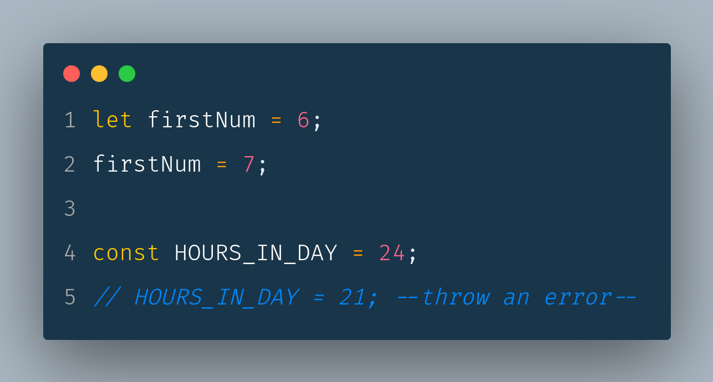

# 2. Arrow function.
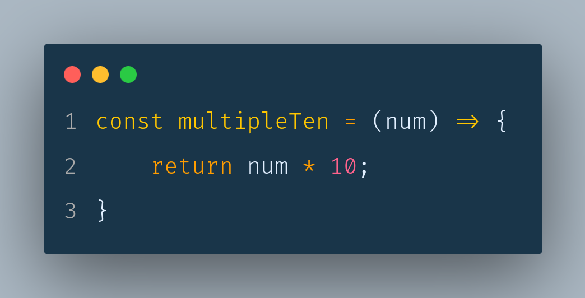
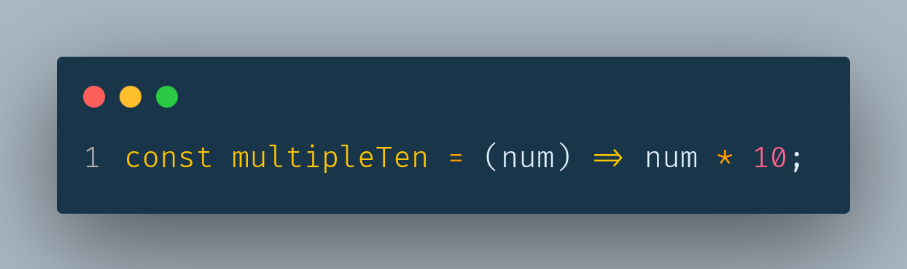
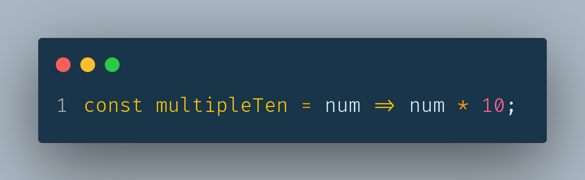

# 3. Default Parameter.
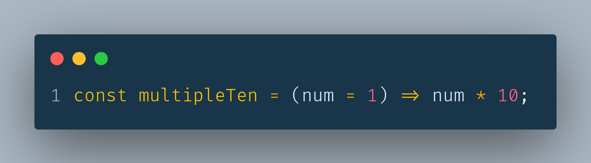

# 4. Template String.
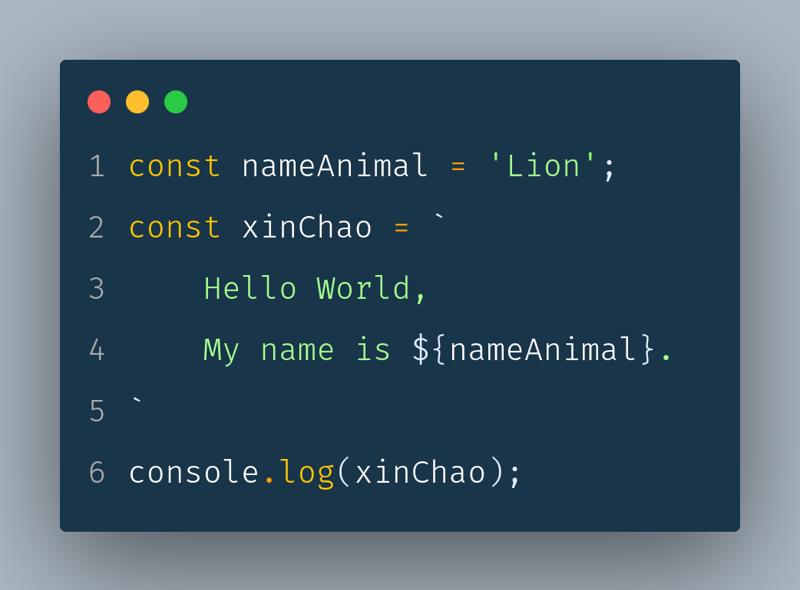

# 5. Rest Parameters. 
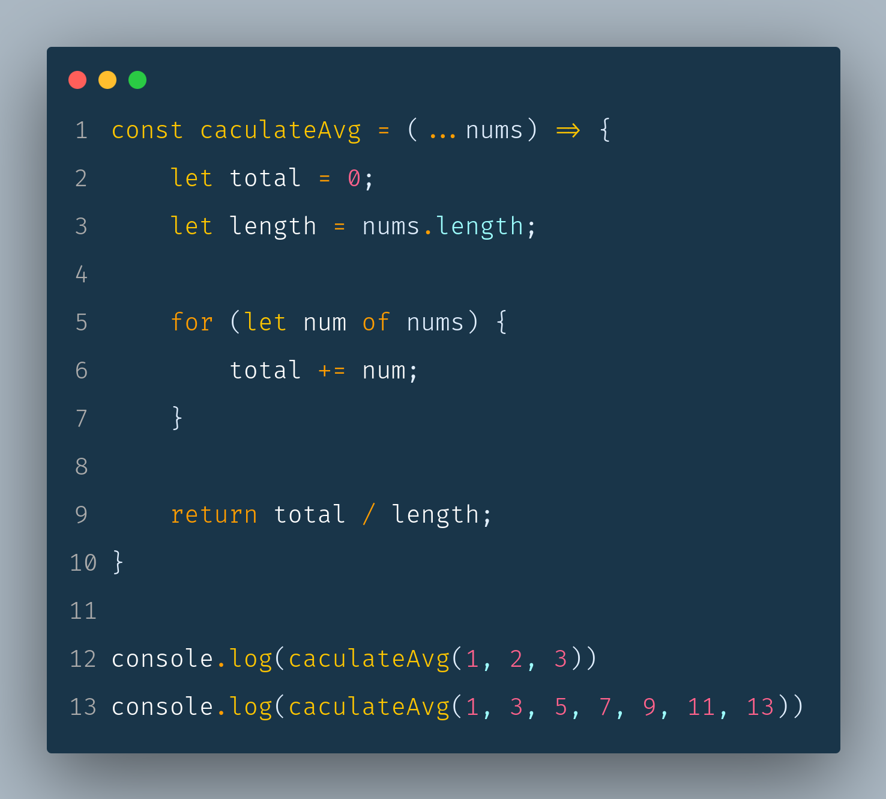

# 6. Spread. 
    1. Array
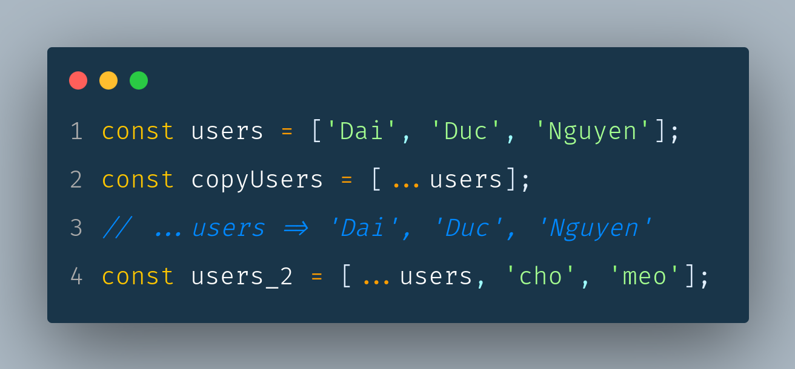
    
    2. Object

# 7. Destructuring. 
    1. Array
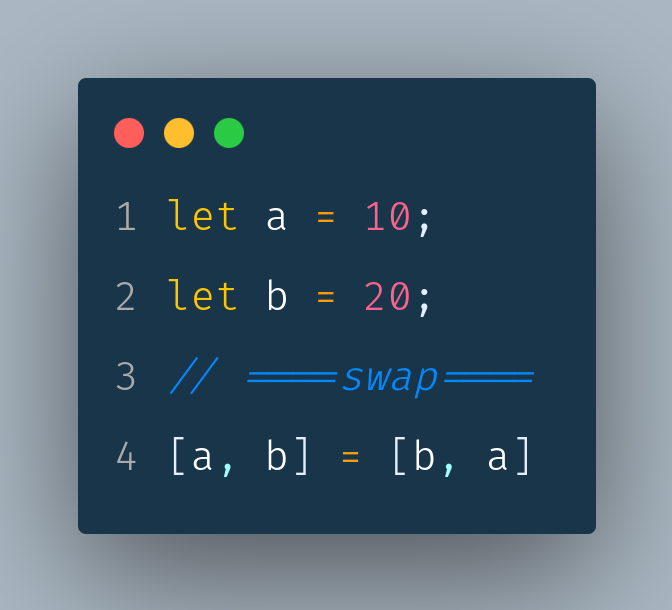
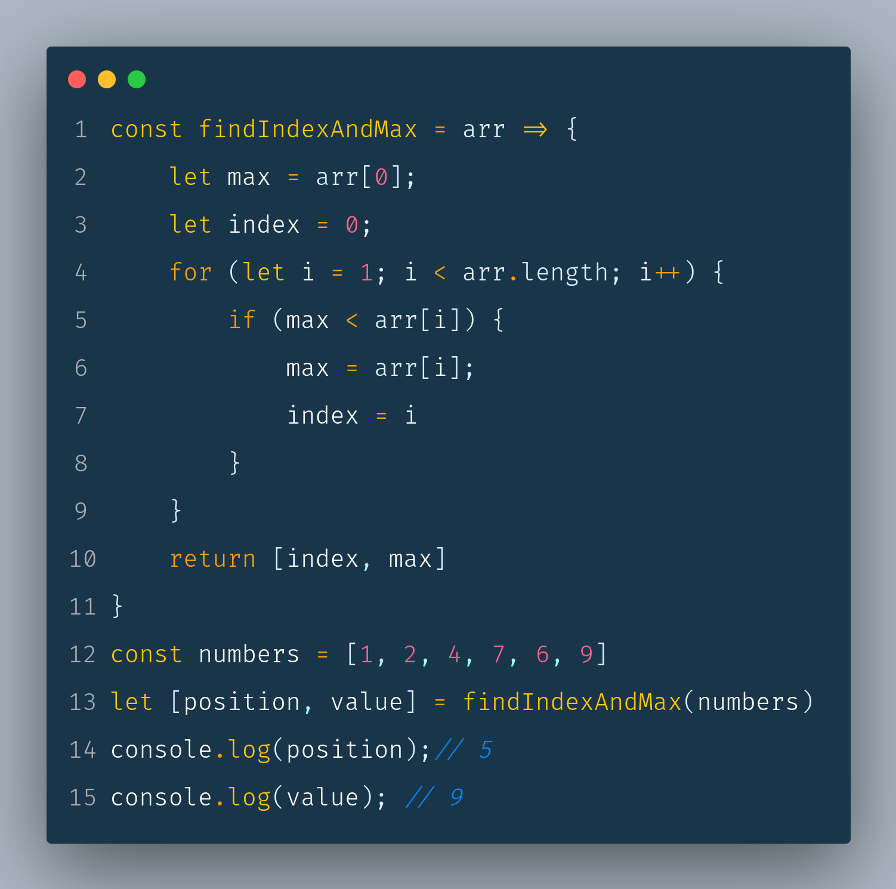
    
    2. Object
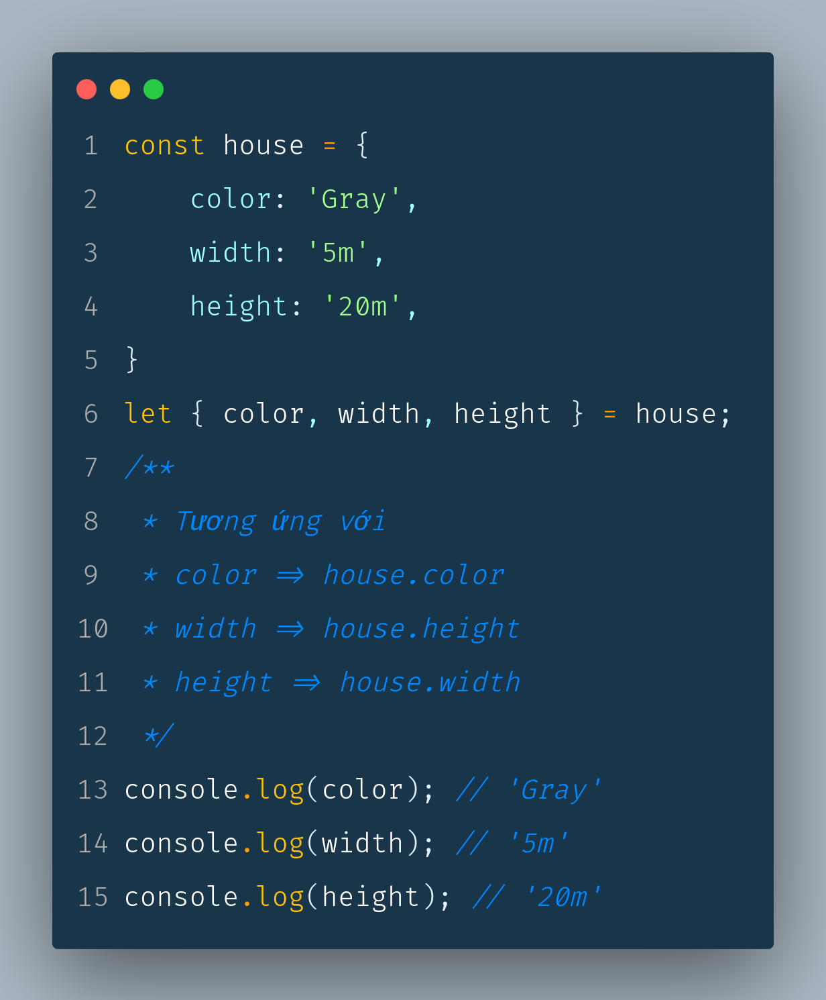
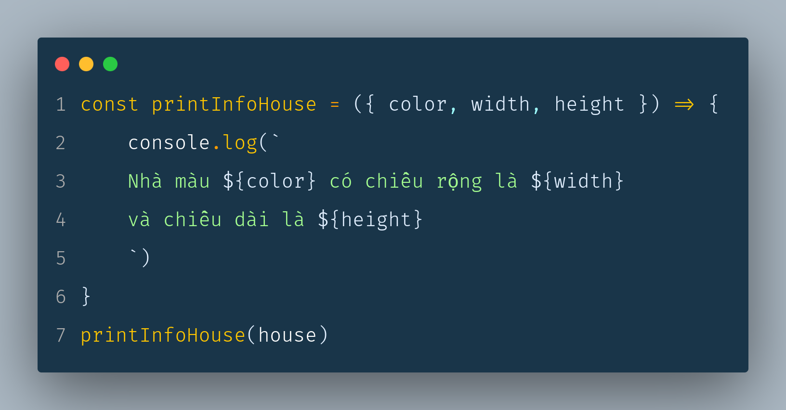
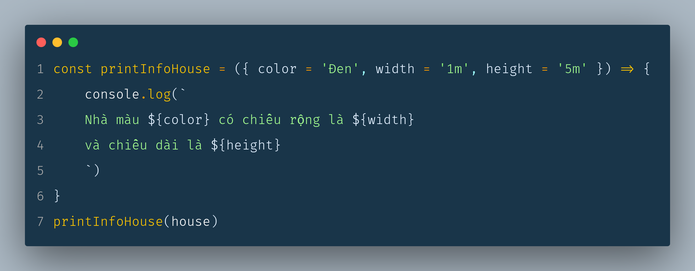

