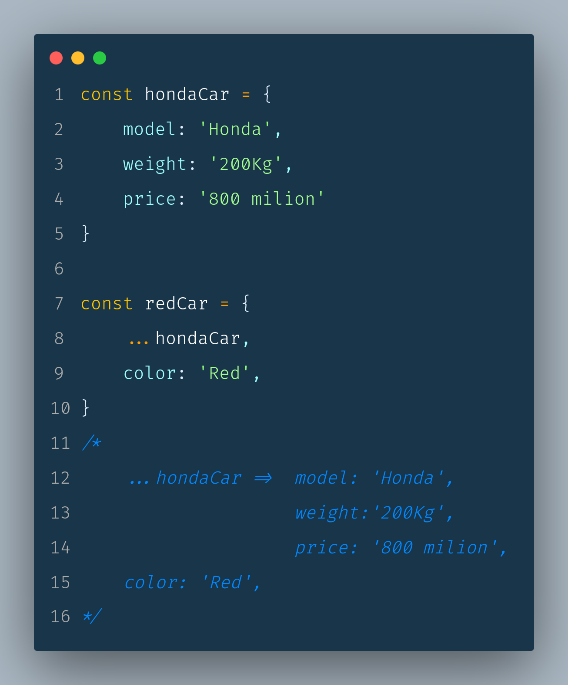

# 1. Variable.
## *let, const*

# 2. Arrow function.

# 3. Default Parameter.

# 4. Template String.

# 5. Rest Parameters. 

# 6. Spread. 
    1. Array

    
    2. Object

# 7. Destructuring. 
    1. Array

    
    2. Object

